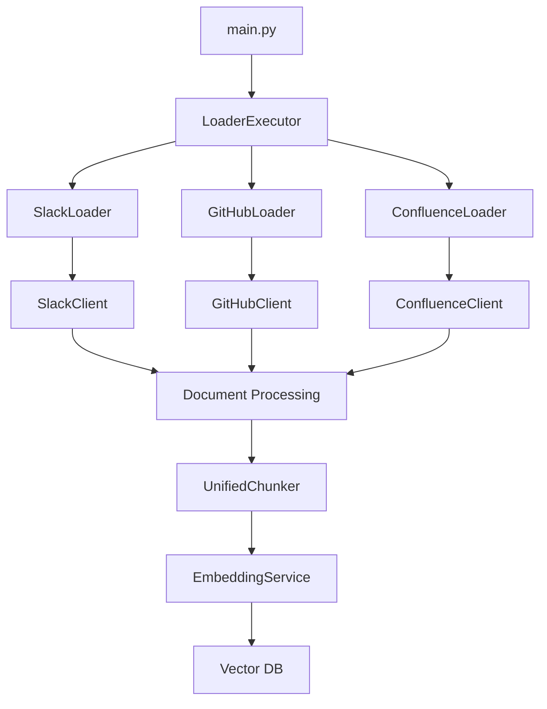

# Content Loader 아키텍처 설계

## 🏗️ 전체 아키텍처

Content Loader는 **계층 분리 아키텍처**를 기반으로 설계되었습니다.

```
content-loader/
├── main.py                    # CLI 진입점
├── executor.py               # 통합 실행기
├── settings.py               # 전역 설정 관리
├── core/                     # 공통 기능 (기반 레이어)
└── loaders/                  # 구현 레이어
    ├── slack/
    ├── confluence/
    └── github/
```

## 🎯 핵심 설계 원칙

### 1. 계층 분리 (Layered Architecture)

- **core/**: 공통 기반 기능 (BaseLoader, Models, Utils)
- **loaders/**: 구체적인 데이터 소스별 구현체
- **의존성 방향**: `loaders/` → `core/` (단방향)

### 2. 독립성 (Independence)

- 각 loader는 완전히 독립적으로 개발/배포 가능
- 새로운 loader 추가 시 기존 코드 수정 불필요
- 설정과 코드가 동일한 디렉토리에 위치

### 3. 확장성 (Extensibility)

- 동일한 인터페이스(`BaseLoader`) 구현으로 일관성 유지
- 플러그인 방식으로 새 loader 추가 가능

## 🔧 핵심 컴포넌트

### **1. Core Layer (공통 기능)**

```python
# core/base.py - 기본 인터페이스
class BaseLoader(ABC):
    @abstractmethod
    async def load_source(self, source: Any) -> AsyncGenerator[Document, None]:
        """데이터 소스에서 문서를 로드"""
        pass

    @abstractmethod
    def validate_source(self, source: Any) -> bool:
        """소스 설정 검증"""
        pass

# core/models.py - 공통 데이터 모델
@dataclass
class Document:
    id: str
    title: str
    text: str
    metadata: Dict[str, Any]
    created_at: datetime
    updated_at: datetime

# core/utils.py - 공통 유틸리티
class UnifiedChunker:
    def chunk_by_content_type(self, text: str, content_type: str) -> List[str]:
        """콘텐츠 타입별 최적화된 청킹"""
        pass

class SimpleMemoryManager:
    def should_pause(self) -> bool:
        """메모리 압박 감지"""
        pass
```

### **2. Execution Layer (실행 계층)**

```python
# executor.py - 통합 실행기
class LoaderExecutor:
    def __init__(self, settings: GlobalSettings):
        self.loaders = {
            "slack": SlackLoader(),
            "github": GitHubLoader(),
            "confluence": ConfluenceLoader()
        }

    async def run_single_loader(self, loader_type: str):
        """특정 loader만 실행"""
        loader = self.loaders[loader_type]
        await loader.execute()

    async def run_all_loaders(self):
        """모든 loader 실행"""
        tasks = [loader.execute() for loader in self.loaders.values()]
        await asyncio.gather(*tasks, return_exceptions=True)
```

### **3. Configuration Layer (설정 계층)**

```python
# settings.py - 설정 관리
class LoaderConfigManager:
    def load_loader_config(self, loader_name: str) -> dict:
        """loader별 설정 로드"""
        config_dir = Path(f"loaders/{loader_name}/config")
        return self._load_with_env_override(config_dir)

    def load_loader_sources(self, loader_name: str) -> dict:
        """loader별 소스 설정 로드"""
        # Slack: channels.yaml, GitHub: repositories.yaml, etc.
        pass
```

## 🔄 데이터 플로우



## 🛡️ 에러 처리 및 복구

### 1. 체크포인트 기반 복구

```python
class CheckpointManager:
    async def save_progress(self, source_key: str, last_processed_id: str):
        """진행 상황 저장 (Redis)"""
        await self.cache_client.set(f"checkpoint:{source_key}", last_processed_id)

    async def get_last_checkpoint(self, source_key: str) -> Optional[str]:
        """마지막 체크포인트 조회"""
        return await self.cache_client.get(f"checkpoint:{source_key}")
```

### 2. Circuit Breaker 패턴

```python
class SimpleCircuitBreaker:
    def __init__(self, failure_threshold: int = 5, timeout: int = 60):
        self.failure_count = 0
        self.state = "CLOSED"  # CLOSED, OPEN, HALF_OPEN

    async def call(self, func, *args, **kwargs):
        """Circuit breaker를 통한 함수 호출"""
        if self.state == "OPEN":
            if time.time() - self.last_failure_time > self.timeout:
                self.state = "HALF_OPEN"
            else:
                raise Exception("Circuit breaker is OPEN")
        # ... 실행 로직
```

## 🚀 성능 최적화

### 1. 메모리 관리

```python
class SimpleMemoryManager:
    def __init__(self, max_memory_mb: int = 1024):
        self.max_memory_mb = max_memory_mb
        self.max_documents_in_memory = 100

    async def process_batch(self, documents: List[Document]):
        """배치 단위 처리로 메모리 압박 방지"""
        batch_size = 20
        for i in range(0, len(documents), batch_size):
            batch = documents[i:i + batch_size]
            await self._process_document_batch(batch)

            if self.should_pause():
                await asyncio.sleep(1)
                import gc; gc.collect()
```

### 2. 연결 풀 관리

```python
class SlackClient:
    def __init__(self, token: str, settings: ConnectionSettings):
        self.semaphore = asyncio.Semaphore(settings.max_concurrent_requests)
        self.timeout = settings.request_timeout

    async def make_request(self, url: str, **kwargs):
        async with self.semaphore:  # 동시 요청 제한
            async with aiohttp.ClientSession() as session:
                # ... 요청 처리
```

## 📊 모니터링 및 메트릭

### 1. 헬스 체크

```python
@app.get("/health")
async def health_check():
    """기본 헬스 체크"""
    return {"status": "healthy", "timestamp": datetime.now().isoformat()}

@app.get("/health/detailed")
async def detailed_health_check():
    """상세 헬스 체크"""
    checks = {
        "redis": await check_redis_connection(),
        "embedding_service": await check_embedding_service(),
        "llm_service": await check_llm_service()
    }
    return {"status": "healthy" if all(checks.values()) else "unhealthy", "checks": checks}
```

### 2. 메트릭 수집

```python
@dataclass
class SimpleMetrics:
    source_type: str
    source_key: str
    start_time: float
    documents_processed: int = 0
    errors_count: int = 0

    def success_rate(self) -> float:
        total = self.documents_processed + self.errors_count
        return self.documents_processed / total if total > 0 else 0.0

class MetricsCollector:
    def get_summary(self) -> dict:
        return {
            "total_sources": len(self.metrics),
            "sources": {k: {
                "duration": v.duration(),
                "documents": v.documents_processed,
                "success_rate": v.success_rate()
            } for k, v in self.metrics.items()}
        }
```

## 🔐 보안 고려사항

### 1. 인증 정보 관리

- 모든 API 키/토큰은 **환경변수**로 관리
- `.env` 파일 및 민감 정보는 **git에서 제외**
- 로그에 인증 정보 **노출 방지**

### 2. API 연결 검증

```python
class ConnectionValidator:
    async def validate_all_connections(self) -> dict:
        """시작 시 모든 외부 서비스 연결 검증"""
        results = {}

        if self.settings.slack_token:
            results["slack"] = await self._validate_slack()
        if self.settings.github_app_id:
            results["github"] = await self._validate_github()

        return results

    async def _validate_slack(self) -> dict:
        """Slack 연결 검증 (auth.test 호출)"""
        try:
            client = AsyncWebClient(token=self.settings.slack_token)
            response = await client.auth_test()
            return {"status": "success", "user_id": response["user_id"]}
        except Exception as e:
            return {"status": "failed", "error": str(e)}
```

## 🔄 확장 방법

### 새로운 Loader 추가

1. **디렉토리 구조 생성**

```
loaders/new_source/
├── config/
│   ├── config.yaml
│   └── sources.yaml
├── loader.py
├── client.py
└── models.py
```

2. **BaseLoader 구현**

```python
from core.base import BaseLoader

class NewSourceLoader(BaseLoader):
    async def load_source(self, source: Any) -> AsyncGenerator[Document, None]:
        # 구현
        pass

    def validate_source(self, source: Any) -> bool:
        # 검증 로직
        pass
```

3. **Executor에 등록**

```python
# executor.py
self.loaders = {
    "slack": SlackLoader(),
    "github": GitHubLoader(),
    "confluence": ConfluenceLoader(),
    "new_source": NewSourceLoader()  # 추가
}
```

이 아키텍처는 **단순하면서도 확장 가능한** 구조로, 각 컴포넌트의 역할이 명확하게 분리되어 있어 유지보수와 확장이 용이합니다.
