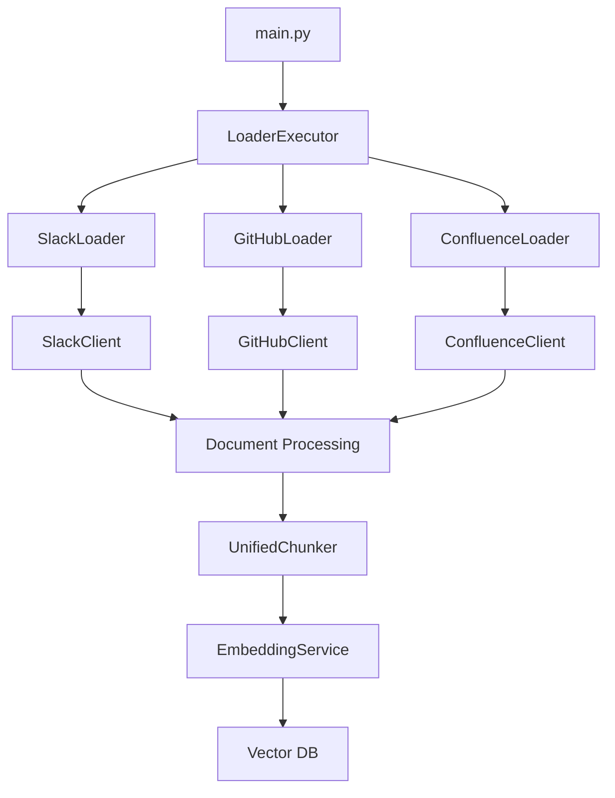

# Content Loader 아키텍처 설계

## 🏗️ 전체 아키텍처

Content Loader는 **계층 분리 아키텍처**를 기반으로 설계되었습니다.

```
content-loader/
├── main.py                    # CLI 진입점
├── executor.py               # 통합 실행기
├── settings.py               # 전역 설정 관리
├── core/                     # 공통 기능 (기반 레이어)
└── loaders/                  # 구현 레이어
    ├── slack/
    ├── confluence/
    └── github/
```

## 🎯 핵심 설계 원칙

### 1. 계층 분리 + 스트리밍 (Layered + Streaming)

- **core/**: 공통 기반 기능 (BaseExecutor, Models, Utils)
- **loaders/**: 구체적인 데이터 소스별 구현체
- **의존성 방향**: `loaders/` → `core/` (단방향)
- **스트리밍**: AsyncGenerator로 메모리 효율적 처리

### 2. 독립성 + 견고성 (Independence + Resilience)

- 각 loader는 완전히 독립적으로 개발/배포 가능
- 새로운 loader 추가 시 기존 코드 수정 불필요
- 설정과 코드가 동일한 디렉토리에 위치
- **통합 재시도 로직**으로 네트워크 오류 대응

### 3. 확장성 + 심플함 (Extensibility + Simplicity)

- 동일한 인터페이스(`BaseExecutor`) 구현으로 일관성 유지
- 플러그인 방식으로 새 loader 추가 가능
- **복잡한 패턴 배제**, 핵심 기능만 구현

## 🔧 핵심 컴포넌트

### **1. Core Layer (공통 기능)**

```python
# core/base.py - 통합 실행기 패턴
@dataclass
class DateRange:
    start: Optional[datetime] = None
    end: Optional[datetime] = None

    def includes(self, target_date: datetime) -> bool:
        if self.start and target_date < self.start:
            return False
        if self.end and target_date > self.end:
            return False
        return True

class BaseExecutor(ABC):
    """통합 실행기 - 스트리밍 + 견고성"""

    def __init__(self, config: Dict[str, Any]):
        self.config = config
        self.retry_handler = SimpleRetryHandler()

    @abstractmethod
    async def fetch(self, date_range: DateRange) -> AsyncGenerator[Document, None]:
        """스트리밍으로 문서 로드"""
        pass

    async def execute(self, date_range: Optional[DateRange] = None) -> AsyncGenerator[Document, None]:
        """실행 + 기본 에러 처리"""
        if not date_range:
            date_range = DateRange()

        async for document in self.retry_handler.execute_with_retry(
            lambda: self.fetch(date_range)
        ):
            yield document

# core/models.py - 공통 데이터 모델
@dataclass
class Document:
    id: str
    title: str
    text: str
    metadata: Dict[str, Any]
    created_at: Optional[datetime] = None
    updated_at: Optional[datetime] = None

# core/utils.py - 심플한 유틸리티
class SimpleRetryHandler:
    """지수 백오프 재시도 로직"""

    async def execute_with_retry(self, func_generator):
        for attempt in range(3):
            try:
                async for item in func_generator():
                    yield item
                break
            except (ConnectionError, TimeoutError) as e:
                if attempt < 2:
                    await asyncio.sleep(2 ** attempt)
                else:
                    raise

class SimpleMemoryManager:
    """배치 단위 메모리 관리"""

    async def process_batch(self, documents_stream, batch_size=20):
        batch = []
        async for doc in documents_stream:
            batch.append(doc)
            if len(batch) >= batch_size:
                yield batch
                batch = []
        if batch:
            yield batch
```

### **2. Execution Layer (실행 계층) - 스트리밍 기반**

```python
# executor.py - 통합 실행기 (스트리밍)
class LoaderExecutor:
    def __init__(self, settings: GlobalSettings):
        self.executors = {
            "slack": SlackExecutor(settings.slack),
            "github": GitHubExecutor(settings.github),
            "confluence": ConfluenceExecutor(settings.confluence)
        }
        self.memory_manager = SimpleMemoryManager()

    async def run_single_loader(self, loader_type: str, date_range: DateRange = None):
        """특정 loader 스트리밍 실행"""
        executor = self.executors[loader_type]

        # 스트리밍 + 배치 처리
        async for batch in self.memory_manager.process_batch(
            executor.execute(date_range)
        ):
            # 배치 단위로 벡터DB 저장
            await self._save_documents_batch(batch)

    async def run_all_loaders(self, date_range: DateRange = None):
        """모든 loader 병렬 실행 (스트리밍)"""
        tasks = []
        for loader_type in self.executors.keys():
            tasks.append(self.run_single_loader(loader_type, date_range))

        await asyncio.gather(*tasks, return_exceptions=True)
```

### **3. Configuration Layer (설정 계층)**

```python
# settings.py - 설정 관리
class LoaderConfigManager:
    def load_loader_config(self, loader_name: str) -> dict:
        """loader별 설정 로드"""
        config_dir = Path(f"loaders/{loader_name}/config")
        return self._load_with_env_override(config_dir)

    def load_loader_sources(self, loader_name: str) -> dict:
        """loader별 소스 설정 로드"""
        # Slack: channels.yaml, GitHub: repositories.yaml, etc.
        pass
```

## 🔄 데이터 플로우



## 🛡️ 에러 처리 및 복구

### 1. 심플한 재시도 로직

```python
class SimpleRetryHandler:
    """지수 백오프 재시도 로직"""

    async def execute_with_retry(self, func_generator, max_retries=3):
        for attempt in range(max_retries):
            try:
                async for item in func_generator():
                    yield item
                break
            except (ConnectionError, TimeoutError, aiohttp.ClientError) as e:
                if attempt < max_retries - 1:
                    backoff_time = 2 ** attempt  # 지수 백오프
                    await asyncio.sleep(backoff_time)
                else:
                    raise
```

### 2. 체크포인트 기반 복구 (증분 업데이트)

```python
class CheckpointManager:
    """DateRange 기반 체크포인트 관리"""

    async def save_progress(self, source_key: str, last_modified: datetime):
        """마지막 처리 시간 저장"""
        await self.cache_client.set(
            f"checkpoint:{source_key}",
            last_modified.isoformat(),
            expire=86400*30  # 30일 보관
        )

    async def get_last_checkpoint(self, source_key: str) -> Optional[datetime]:
        """마지막 체크포인트로 DateRange 구성"""
        checkpoint = await self.cache_client.get(f"checkpoint:{source_key}")
        return datetime.fromisoformat(checkpoint) if checkpoint else None
```

## 🚀 성능 최적화

### 1. 스트리밍 메모리 관리

```python
class SimpleMemoryManager:
    """스트리밍 기반 배치 처리"""

    async def process_batch(self, documents_stream, batch_size=20):
        """스트리밍 + 배치 처리로 메모리 효율성"""
        batch = []
        async for doc in documents_stream:
            batch.append(doc)

            if len(batch) >= batch_size:
                yield batch
                batch = []
                # 메모리 정리
                import gc; gc.collect()

        if batch:  # 마지막 배치
            yield batch
```

### 2. 페이지네이션 처리

```python
class BaseExecutor:
    """커서 기반 페이지네이션"""

    async def _paginate_fetch(self, initial_params: dict):
        """커서 기반으로 페이지별 데이터 가져오기"""
        cursor = None

        while True:
            params = {**initial_params}
            if cursor:
                params['cursor'] = cursor

            response = await self._make_request(params)

            for item in response.get('items', []):
                yield item

            # 다음 페이지 확인
            if not response.get('has_next_page'):
                break
            cursor = response.get('next_cursor')
```

### 3. 연결 풀 관리

```python
class SimpleClient:
    """재시도 로직 + 연결 관리"""

    def __init__(self, settings):
        self.semaphore = asyncio.Semaphore(settings.max_concurrent)
        self.retry_handler = SimpleRetryHandler()

    async def make_request(self, url: str, **kwargs):
        async with self.semaphore:
            # 재시도 로직 적용
            async for response in self.retry_handler.execute_with_retry(
                lambda: self._single_request(url, **kwargs)
            ):
                return response
```

## 📊 모니터링 및 메트릭

### 1. 헬스 체크

```python
@app.get("/health")
async def health_check():
    """기본 헬스 체크"""
    return {"status": "healthy", "timestamp": datetime.now().isoformat()}

@app.get("/health/detailed")
async def detailed_health_check():
    """상세 헬스 체크"""
    checks = {
        "redis": await check_redis_connection(),
        "embedding_service": await check_embedding_service(),
        "llm_service": await check_llm_service()
    }
    return {"status": "healthy" if all(checks.values()) else "unhealthy", "checks": checks}
```

### 2. 메트릭 수집

```python
@dataclass
class SimpleMetrics:
    source_type: str
    source_key: str
    start_time: float
    documents_processed: int = 0
    errors_count: int = 0

    def success_rate(self) -> float:
        total = self.documents_processed + self.errors_count
        return self.documents_processed / total if total > 0 else 0.0

class MetricsCollector:
    def get_summary(self) -> dict:
        return {
            "total_sources": len(self.metrics),
            "sources": {k: {
                "duration": v.duration(),
                "documents": v.documents_processed,
                "success_rate": v.success_rate()
            } for k, v in self.metrics.items()}
        }
```

## 🔐 보안 고려사항

### 1. 인증 정보 관리

- 모든 API 키/토큰은 **환경변수**로 관리
- `.env` 파일 및 민감 정보는 **git에서 제외**
- 로그에 인증 정보 **노출 방지**

### 2. API 연결 검증

```python
class ConnectionValidator:
    async def validate_all_connections(self) -> dict:
        """시작 시 모든 외부 서비스 연결 검증"""
        results = {}

        if self.settings.slack_token:
            results["slack"] = await self._validate_slack()
        if self.settings.github_app_id:
            results["github"] = await self._validate_github()

        return results

    async def _validate_slack(self) -> dict:
        """Slack 연결 검증 (auth.test 호출)"""
        try:
            client = AsyncWebClient(token=self.settings.slack_token)
            response = await client.auth_test()
            return {"status": "success", "user_id": response["user_id"]}
        except Exception as e:
            return {"status": "failed", "error": str(e)}
```

## 🔄 확장 방법

### 새로운 Executor 추가

1. **디렉토리 구조 생성**

```
loaders/new_source/
├── config/
│   ├── config.yaml
│   └── sources.yaml
├── executor.py     # 실행기
├── client.py
└── entities.py     # 데이터 모델
```

2. **BaseExecutor 구현**

```python
from core.base import BaseExecutor, DateRange, Document

class NewSourceExecutor(BaseExecutor):
    def __init__(self, config: dict):
        super().__init__(config)
        self.client = NewSourceClient(config)

    async def fetch(self, date_range: DateRange) -> AsyncGenerator[Document, None]:
        """스트리밍으로 문서 로드"""

        # 증분 업데이트
        params = self._build_query_params(date_range)

        # 페이지네이션 처리
        async for item in self._paginate_fetch(params):
            document = self._item_to_document(item)
            yield document

    def _build_query_params(self, date_range: DateRange) -> dict:
        """DateRange를 API 파라미터로 변환"""
        params = {}
        if date_range.start:
            params['modified_since'] = date_range.start.isoformat()
        if date_range.end:
            params['modified_until'] = date_range.end.isoformat()
        return params
```

3. **LoaderExecutor에 등록**

```python
# executor.py
self.executors = {
    "slack": SlackExecutor(settings.slack),
    "github": GitHubExecutor(settings.github),
    "confluence": ConfluenceExecutor(settings.confluence),
    "new_source": NewSourceExecutor(settings.new_source)  # 추가
}
```

## 🎯 개선 요약

### ✅ 적용된 핵심 패턴들

1. **BaseExecutor 패턴**: 일관된 `fetch()` 인터페이스
2. **스트리밍 처리**: `AsyncGenerator[Document, None]` 반환
3. **견고한 재시도**: 지수 백오프 + HTTP 상태코드별 처리
4. **DateRange 기반**: 증분 업데이트 최적화
5. **페이지네이션**: 메모리 효율적 대용량 처리
6. **배치 처리**: 스트리밍과 결합한 메모리 관리

### 🎯 심플함 유지

- **복잡한 Circuit Breaker 제거** → 심플한 재시도만
- **요약 기능은 옵션** → 기본 기능에 집중
- **최소한의 인터페이스** → BaseExecutor 하나로 통일
- **설정 기반 확장** → 코드 변경 최소화

이 아키텍처는 **견고함과 심플함**을 결합한 구조로, 확장성과 유지보수성을 모두 확보했습니다.
